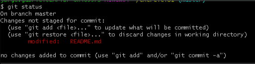
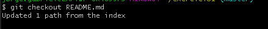
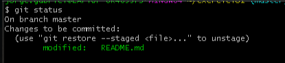
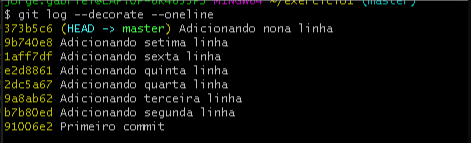
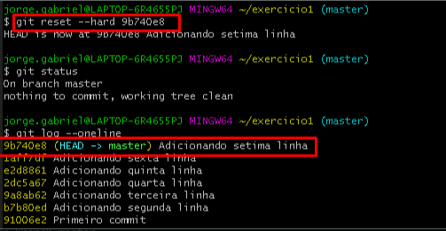

# Reverting changes

## Before commit

### git checkout
\
The gitcheckout command is used to revert a change made to a given file before it is committed. In other words, gitcheckout reverts the state of a modified file back to the stage area. This is very useful for correcting errors or changes before a commit.

For example, let's add one more line to our exercise file, which has four lines.

```bash
echo "Add next line" >> README.md
```

And check status
```bash
git status
```

The file left the stage area and went to modified.



However, when running **git diff**, we see that the change that was made is wrong! We need to fix it before going to the commit.

```bash
git checkout README.md
git status
```


Ok, git checkout changed the state of the file from modified to stage again.

**Note**: if you have incorrectly added a directory with several sub-directories, use the command **git restore --staged** as shown in the example below.

```bash
git restore --staged .
```

Reference:

- [https://git-scm.com/docs/git-checkout](https://git-scm.com/docs/git-checkout)

## After commit


### git reset
\
The git reset command does the exact opposite of the git checkout command. To recap, the git checkout command reverses the changes made to an unmodified file (file that is in the staging area and has been changed, thus changing to modified), that is, if a change has been made and needs to be reversed, before the commit , git checkout solves this, returning the file to the state of unchanged. On the other hand, the command git reset serves to revert a file from the state of unchanged to modified.

To exemplify, let's do a little exercise:

- add a new line in the README.md file;
- check the change made;
- reverse the change;
- add the correct change to the file;
- add the file in the staging area;
- check the change made;
- add the file again in the staing area;
- commit.

First change
```bash
echo "Add line => 1" > README.md
git add README.md
git status
```

Change wrong and fix (before commit)
```bash
echo "Add line => 3" >> README.md
git diff
```

```bash
git checkout README.md
echo "Add line => 2" >> README.md
git status README.md
git add README.md
git status README.md
```

```bash
git reset HEAD
git commit -m "Add line => 2"
```

So far, we've seen how to revert the state of files before committing. Now let's see how to revert after the commit using the `git reset` command in the following ways:

- `--mixed`: Restart the index, but not the work tree (that is, the changed files are preserved, but not marked for confirmation) and report what has not been updated. This is the standard action;
- `--soft`: just revert the commit to the stage state, that is, ready to be committed again.
- `--hard`: Resets the index and the working tree. Any changes to files tracked in the work tree since <commit> are discarded.

## Modes

### `--mixed`

Vamos simular um commit feito de maneira errada. Posteriormente, vamos revertê-lo com o auxílio do modo `--mixed`.  A operação abaixo foi feita de maneira errado e precisa ser revertida.

### Commit operation with error
```bash
echo "Add next line" > README.md
git status
git add README.md
git commit -m "Add next line"
```

### Correcting the wrong commit operation
\
The reversal solution consists of a few steps:

- Identify the wrong commit;
- Identify the commit immediately prior to the wrong commit;
- Undo the wrong commit;
- Check changes;
- Correct;
- Add changes;
- Apply correct commit.

```bash
git log --decorate --oneline
git show <ID-COMMIT>
git reset <ID-COMMIT-ANTERIOR>
git log --decorate --oneline
git status
git diff
git checkout
echo "Add line: 7" >> README.md
git status
git add README.md
git commit -m "Add line 7"
```

This is a way to reverse a wrong commit and apply the fix with the help of git checkout.

### `--soft`

The `--soft` mode reverses a commit leaving the files in the staging area ready to be committed again.

We will simulate a commit and use the `--soft` mode to revert it and verify the changes.

```bash
echo "Add line: 8" >> README.md
git status
git diff
git add README.md
git commit -m "Add line: 8"
git status
git log --decorate --oneline
git reset --soft <ID-COMMIT>
git status
```

After that, the changes made to the file are ready to be committed.




**Important**: this procedure can be done when a certain update is not being applied. Thus, with the `--soft` option it is ready to be applied at any time.

### `--hard`

The `--hard` mode is the most aggressive in terms of reversing the commit, since it removes the commit and also the changes made.

Let's simulate a commit and use the `--hard` mode to completely reverse it.

```bash
echo "Add line 9" >> README.md
git status
git diff
git add README.md
git commit -m "Add line 9"
git status
git log --decorate --oneline
```


```bash
git reset --hard 9b740e8
git status
git log --decorate --oneline
```



**Referências**:
- [https://git-scm.com/docs/git-reset](https://git-scm.com/docs/git-reset)