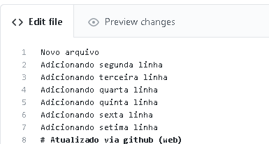

# Update local repository

We will update the local repository from the remote repository. For this, we will use the command `git pull`.

First, let's change the [READM.md] file on the git hub.



Adding a commit message


Returning to the local repository, we will also add a new line in the README.md file.

```bash
echo "Changes local on README.md" >> README.md
git add README.md
git commit -m "Changes local on README.md"
git log --oneline
```

We can see that the last two commits were done remotely and locally, respectively.


That done, let's try to apply this change made locally to our repository on github.

```bash
git push -u origin master
```

and ops...


There is a conflict of interest here hehehe ... let's align the ideas. As git itself suggests, we need to do a git pull to first pull the remote changes.

```bash
git pull
```

ops ... the conflict still remains.


```bash
git status
```


The last change made to the README.md file was made locally. In this example, we want to keep the remote repository intact. So we need to remove the local commit.

```bash
git reset --hard d3c7bfe
git status
```


That done, now we can do the correct procedure with git pull.
```bash
git pull 
git status
git show dc3ba1a
```

Ready, both repositories, local and remote, synchronized.


**Tip**: whenever you need to download a remote repository, do git pull first and then make changes and then perform git push.