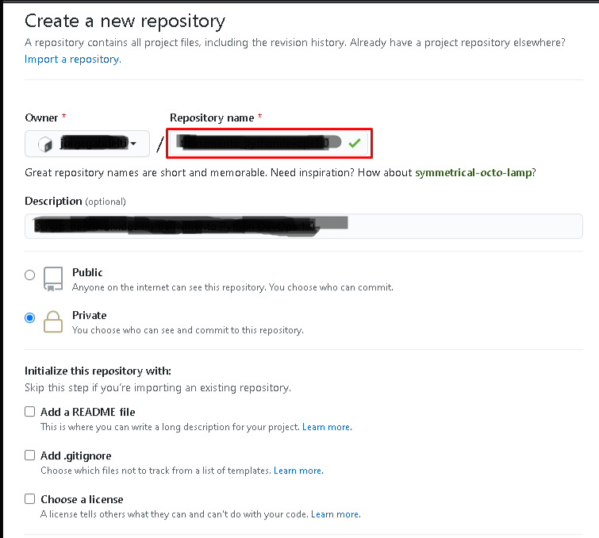

# Git repository
So far working only with local repositories. To work collaboratively, a remote and distributed repository is required. Among the main centralized repository systems, there are:

- github
- bitbucket
- gitlab

These applications support two types of repositories:

- public;
- private.

We will use github to configure the remote repository.



As we already have a local repository, we will just add this new repository.

```bash
git remote add origin https://github.com/<username>/<repository>.
git remote -v 
```

Now just push the local files to the remote repository.

```bash
git push -u origin master
```

Local files will be replicated to the remote repository.
