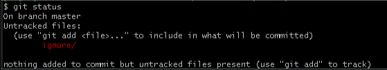
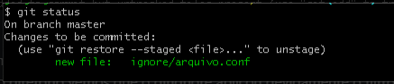
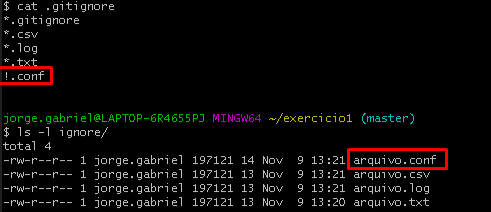

# Ignore files with gitignore

The `gitignore` file in the repository directory has the role of ignoring some files so that they do not go up into the repository.

The file structure can be as follows:
```bash
*.<EXTENSAO>
```

Example:
```bash
*.csv
*.log
!.conf
```

Following the idea of the example, let's do a little exercise:

- Create any directory;
- Create three files with different extensions:
     - .csv
     - .log
     - .conf
- create the .gitignore file;
- add all the files in the directory on stage;
- commit.

Resolution
```bash
mkdir ignore
echo "file .csv" > ignore/arquivo.csv
echo "file .log" > ignore/arquivo.log
echo "file .conf" > ignore/arquivo.conf
```

Before creating the **.gitignore** file, we can see that the entire directory is untracked:

Após criar o rquivo .gitignore
```bash
*.csv
*.log
*.txt
!.conf
```

Validation
```bash
git status
```


Apparently the file did not change, however, after applying git add to the directory we see that gitignore applied the filter properly.

```bash
git add ignore/
git status
```



\
